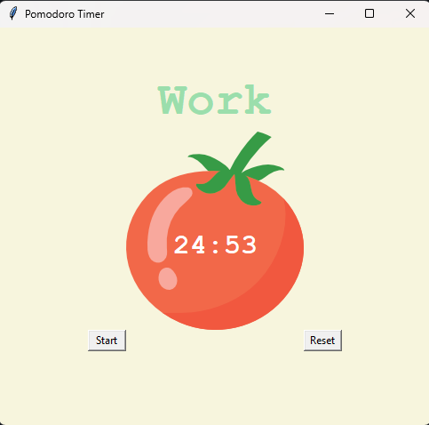
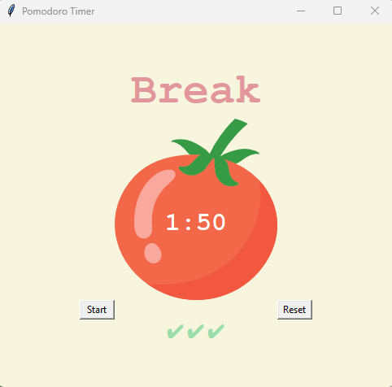

# Pomodoro Timer

Ce projet consiste en une application de minuterie Pomodoro réalisée en utilisant le module Tkinter en Python. La technique Pomodoro est une méthode de gestion du temps développée par Francesco Cirillo dans les années 1980, qui encourage la division du temps de travail en intervalles courts appelés "Pomodoros", suivis de courtes pauses. Le script réalise un minuteur Pomodoro simple avec des sessions de travail de 1 minute, des pauses courtes de 5 minutes, et des pauses longues de 20 minutes. Le compteur de sessions (reps) permet d'alterner entre ces phases.

## Constantes

Le projet utilise les constantes suivantes pour définir la durée du travail, des pauses courtes et longues, ainsi que les couleurs utilisées dans l'interface graphique.

- Durée du travail (`WORK_MIN`): 25 minutes
- Pause courte (`SHORT_BREAK_MIN`): 5 minutes
- Pause longue (`LONG_BREAK_MIN`): 20 minutes
- Couleurs (`PINK`, `RED`, `GREEN`, `YELLOW`): Couleurs définies en hexadécimal
- Police (`FONT_NAME`): "Courier"
- Session (`reps`): 0
- timer (`timer`): None
  
## Fonctionnalités

- **Réinitialisation de la minuterie (`reset_timer`):** Cette fonction est appelée lorsqu'on clique sur le bouton "Reset". Elle annule tout minutage en cours, réinitialise l'affichage de la minuterie à "00:00", rétablit le texte du timer à "Timer" et réinitialise le compteur de sessions (reps).
  
- **Démarrage de la minuterie (`start_timer`):**
  - Cette fonction est appelée lorsqu'on clique sur le bouton "Start". Elle commence par incrémenter le compteur de sessions (reps).
  - Si le nombre de sessions est impair, cela signifie que c'est une session de travail (Work). La fonction count_down est appelée avec la durée du travail (WORK_MIN*60), et le texte du timer est configuré en vert.
  - Si le nombre de sessions dépasse 7, cela signifie que c'est une pause longue (Long Break). La fonction count_down est appelée avec la durée de la pause longue (LONG_BREAK_MIN*60), et le texte du timer est configuré en rouge.
  - Sinon, c'est une pause courte (Short Break). La fonction count_down est appelée avec la durée de la pause courte (SHORT_BREAK_MIN*60), et le texte du timer est configuré en rose.

- **Mécanique du compte à rebours (`count_down`):**
  - Cette fonction prend en paramètre le temps total en secondes.
  - Elle convertit ce temps en minutes et secondes, met à jour l'affichage de la minuterie (canvas.itemconfig(timer_text)), et configure la récursivité avec window.after pour mettre à jour la minuterie chaque seconde.
  - Lorsque le temps atteint zéro, elle appelle start_timer pour passer à la session suivante, et ajoute des marques de vérification (✔) pour chaque session de travail complétée.

- **Interface utilisateur (`UI SETUP`):**
  - L'interface utilisateur est créée en utilisant le module Tkinter.
  - Une fenêtre est créée avec un fond jaune, une image de tomate, un texte de minuterie, des étiquettes (labels), et des boutons "Start" et "Reset".
  - Lorsqu'on clique sur le bouton "Start", la fonction start_timer est appelée, et lorsqu'on clique sur "Reset", la fonction reset_timer est appelée. 

## Installation et Configuration

- Python 3.9.6
- Importation du module tkinter (`import tkinter`)

## Capture d'écran

 

## Remarques

Projet réalisé dans le cadre du cours [100 Days of Code: The Complete Python Pro Bootcamp](https://www.udemy.com/course/100-days-of-code/) de Angela Yu sur la plateforme Udemy.
